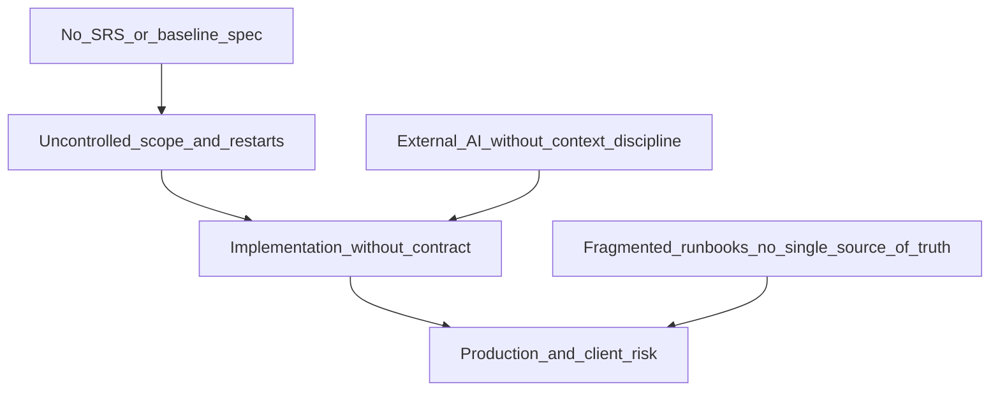
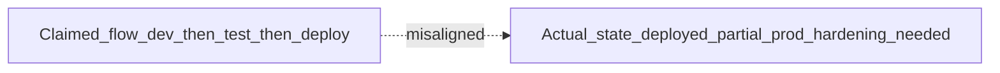
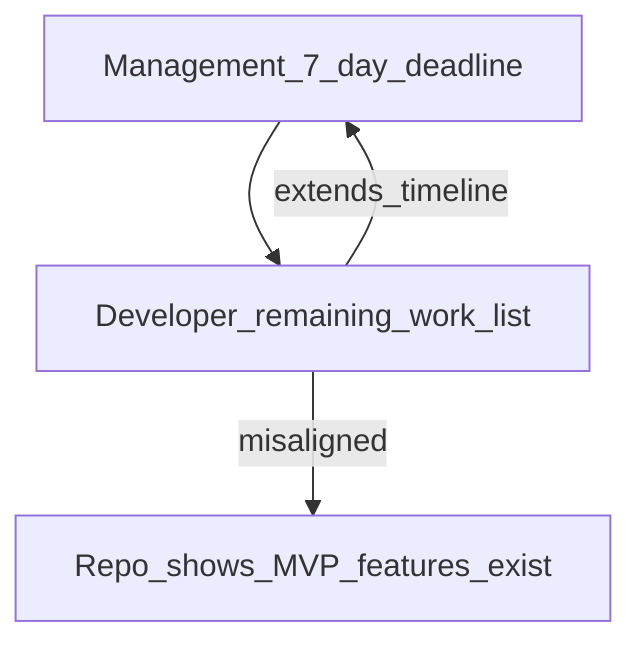

# External Project Audit & Engineering Governance Report

**Project:** Stoko's Web Ordering (`stokos-loch-raven`)  
**Audit type:** Post-hoc technical and process review  
**Evidence base:** Git history, repository structure, `docs/` delivery artifacts, observed production/staging behavior (user-reported)  
**Date:** June 2026  
**Scope:** Requirements governance, management planning, engineering execution, AI tooling discipline, documentation coherence  
**Out of scope:** Legal/commercial disputes; attribution to named individuals  

**Roles referenced in this document:** *agency management*, *primary contributing developer*, *remediation engineer*, *client*, *operations owner* (Stripe/MongoDB).

---

## 1. Executive summary

This audit finds that delivery risk on the Stoko's ordering platform is **systemic**, not the result of a single bad commit or missing feature. Three reinforcing failures drove the current state:

1. **Management never established a baseline SRS or scope** before engineering began, then internalized the project without a coherent spec when other work was halted.
2. **Implementation proceeded without a contract** — no acceptance criteria, no milestone gates, and no proactive technical spec from the primary developer until directed by others.
3. **Execution relied on vibe coding and external chat-AI** — symptom patches, giant unmaintainable files, zero automated tests, and observed incidents where AI-generated text (including Hindi prompt material) reached customer-facing surfaces or management status reports.

The repository contains substantial menu-admin UI work (~137 commits in the primary development phase). It also shows that **launch-critical capabilities** (order persistence, webhooks, hardened admin auth, production runbooks) were back-loaded and completed or remediated later. The system is **deployed but not production-ready** for a paying client without P0 hardening defined in [prod-plan1.md](./prod-plan1.md).



### Findings at a glance

| Finding | Severity |
|---------|----------|
| No SRS / scope document before build | Critical |
| Management took project in-house without coherent spec | Critical |
| Development proceeded without developer-driven spec proposal | High |
| Vibe-coding patterns in git history (symptom fixes, god files, no tests) | High |
| External chat-AI usage without IDE context discipline | High |
| Observed production leak of chat-AI prompt text (Hindi) on customer-facing UI | High |
| GPT-generated project status misrepresents phase (claims 1–1.5 months dev left before testing/deploy) | High |
| "Remaining work" list to management misstates built features as incomplete | Critical |
| Conflicting timeline commitments (3–4 months, 1 month frontend, 1–1.5 months dev, "7 days impossible") | High |
| Post-hoc planning docs contradict each other | Medium |

**Audit conclusion:** Failure was organizational and procedural as much as technical. Recovery requires a written scope, aligned timelines, context-aware engineering, and verifiable acceptance — not more unstructured development time.

---

## 2. Management and governance failures

### 2.1 No requirements baseline

At project inception there was **no Software Requirements Specification (SRS)**, scope statement, or signed acceptance criteria. Work began on menu admin UI and customer-facing pages without a documented definition of:

- End-to-end order flow (browse → cart → pay → kitchen → complete)
- Payment model (direct Stripe vs Connect, refunds, failed payments)
- Multi-branch rules (filtering, permissions, per-store config)
- Admin roles and provisioning
- Go-live definition and who signs off

The `docs/` folder today contains **post-hoc** checklists ([qa-checklist.md](./qa-checklist.md), [vercel-env-checklist.md](./vercel-env-checklist.md), [client-onboarding.md](./client-onboarding.md)) but **no requirements document** that predates implementation.

**Standard violated:** No client-revenue code on `main` until a 1–2 page scope + acceptance checklist is written and agreed.

### 2.2 Portfolio disruption without handoff

Management halted other development work and brought the Stoko's project in-house. That decision was not accompanied by:

- A requirements freeze
- A written handoff from any prior owner
- A single authoritative spec against which to build, review, or reject work

Engineers therefore built what was imaginable (menu CRUD, UI polish) rather than what was **specified**.

### 2.3 Inconsistent acquisition and planning

The project moved across ownership models (external contribution → agency internal → remediation by a separate engineer) without change control. Each transition added code and docs but not a unified plan. Accountability became blurred — evidenced by [prod-plan1.md](./prod-plan1.md) describing features as both "pre-existing" and "handoff to developer."

### 2.4 Missing governance artifacts

| Artifact | Status in repo |
|----------|----------------|
| SRS / functional spec | Absent |
| Non-functional requirements (performance, security, uptime) | Absent |
| RACI with decision rights | Partial (retroactive matrix in prod-plan only) |
| Milestone sign-off gates | Absent |
| Single source of truth for "done" | Absent |

### 2.5 Consequence

Launch-critical path work — auth in [proxy.ts](../proxy.ts), order model, checkout persistence, Stripe webhook, guest tracking — landed in the `stokos-app-ops` merge and subsequent remediation commits, **not** in the bulk of early menu-admin commits. Management allowed months of visible UI progress while the money path remained immature.

---

## 3. Requirements and developer responsibility

Professional implementers **propose** a technical spec when management does not provide one: data model, API contracts, milestone breakdown, and risks.

**Observed gap:** The primary contributing developer did not draft or suggest a spec unless explicitly told to. The repository reflects implementation-first behavior:

- **~137 commits** in the primary development phase (menu admin, June 2026)
- Commit messages such as `code updated`, `loading menu issue resolve`, `category form coded 2` — indicating trial-and-error without a documented target state

**Expected practice:** spec → milestones → PRs mapped to requirement IDs → verification.

**Audit expectation going forward:** If no SRS exists, the developer must produce a draft spec for management approval **before** adding thousands of lines to shared files. Waiting to be asked is a process failure, not a courtesy.

---

## 4. Engineering execution audit

This section summarizes evidence from git history and code structure. It describes the **primary development phase** (menu admin and related customer UI), anonymized.

### 4.1 Commit history does not tell a coherent story

| Message pattern | Problem |
|-----------------|--------|
| `code updated`, `updated code 2`, `code updated 4` | Impossible to determine what changed or why |
| `loading menu issue resolve` (~6+ similar) | Same symptom addressed repeatedly without documented root cause |
| `category form coded` → `coded 2` → `coded 3` | One feature spread across vague incremental dumps |
| Typos (`menumanagment`, `autometically`, `chnage`) | No review before push |

**Professional standard:** Each commit or PR answers: *What changed? Why? How was it verified?*

Example of an acceptable message:

```
fix(menu): invalidate store snapshot after category store-config write

Category edits were not visible on the customer menu until a full page
reload because rebuildStoreMenuSnapshot was skipped on PATCH.

- Call invalidateStoreMenu after category config save
- Remove 1s polling workaround on client (follow-up PR)

Tested: edit category visibility for towson store; customer menu updates
within one navigation without poll.
```

### 4.2 Symptom fixing instead of root-cause engineering

The menu loading / auto-update thread spans **15+ commits**, including:

- `loading store menu issue resolve`
- `auto update menu`
- `update menu fast autometically`
- `Fix customer menu auto-update polling and fresh API refetch`
- `Optimize menu products fetch for faster updates`
- `Optimize admin menu fast loading`

The current mitigation polls the customer menu **every 1 second**:

```ts
// components/menusectionclient.tsx
const MENU_POLL_INTERVAL_MS = 1000;
```

Polling is a bridge, not architecture. On Vercel it increases request volume and Mongo load while masking the real defect: **admin changes do not propagate to the customer view through a defined invalidation path.**

### 4.3 God files — unmaintainable structure

| File | ~Lines | Concern |
|------|--------|---------|
| `app/admin/forms/productform.tsx` | 3,032 | Product wizard + validation + UI in one component |
| `app/admin/menu/usemenucrud.ts` | 1,844 | CRUD, normalization, API quirks in one hook |
| `app/api/admin/menu/products/route.ts` | 1,324 | HTTP + business logic + DB in one route |
| `app/admin/menu/menumanagementclient.tsx` | 1,361 | Orchestration + UI + state |
| `lib/server/menuproducts.ts` | 1,019 | Query + cache + shape normalization |

**Professional structure:** thin routes, service layer, split UI modules, shared validated types at boundaries.

### 4.4 Defensive guessing instead of API contracts

`usemenucrud.ts` probes multiple JSON keys per entity because responses were never standardized:

```ts
const RESPONSE_KEYS: Record<MenuEntity, string[]> = {
  products: ["product", "products"],
  categories: ["category", "categories"],
  "modifier-groups": ["modifierGroup", "modifierGroups", "modifier", "modifiers"],
  // ...
};
```

`lib/server/menuproducts.ts` probes multiple Mongo collection name variants for modifier groups. This survives chaos; it does not create reliability.

### 4.5 No automated verification

- No test runner in `package.json` (no Jest, Vitest, Playwright)
- No `*.test.ts` / `*.spec.ts` for critical paths
- No CI test gate

For multi-store menus, modifiers, checkout, and webhooks, manual clicking alone explains repeated "menu loading" fixes — nothing prevents regression.

**Minimum bar:** smoke tests for menu load per store slug, checkout session creation, and admin order status transitions.

### 4.6 Production concerns back-loaded

| Capability | Primary phase | Later / remediation |
|------------|---------------|---------------------|
| Menu admin UI | Extensive | — |
| Multi-store product/category configs | Extensive | — |
| Order persistence before payment | — | `stokos-app-ops` merge |
| Stripe webhook → paid order | — | Later |
| Clerk admin auth + email allowlist | — | Added / hardened later |
| Guest order tracking | — | Later |
| Production runbooks | — | [prod-plan1.md](./prod-plan1.md) and checklists |

Early checkout work was a thin Stripe session creator (~76 lines). Production checkout — tax, delivery fee, Mongo order, webhook, success fallback — is materially different engineering.

### 4.7 Error handling and operability

- `alert()` for user-facing errors in admin forms
- `console.error` as primary observability
- Some API failures return empty arrays that resemble "no data"

Failures must be visible to staff and operators, not silent.

### 4.8 Pseudo-optimizations

- In-memory `memCache` on serverless (per-instance, inconsistent under load)
- 1-second client polling (masks invalidation bugs)
- Commits titled "Optimize menu fast loading" with no documented before/after metrics

---

## 5. AI tooling and vibe coding

This audit does **not** prohibit AI assistance. It flags **observed anti-patterns**:

| Anti-pattern | Risk |
|--------------|------|
| External chat AI (browser GPT) instead of repo-aware IDE tools (Codex/Cursor with codebase context) | Hallucinated APIs, wrong patterns, copy-paste misaligned with project conventions |
| No context engineering (no file references, types, or "read X before editing Y") | Large generic dumps → god files and defensive `any` (~61 in `usemenucrud.ts` alone) |
| AI output committed without human review | Instruction or prompt text shipped to users |

### 5.1 Observed incident: prompt text on customer UI

**User-reported; not found in current `main` git history** — Hindi chat-AI prompt or instruction text appeared on the **customer-facing website**. This indicates raw external-session output was pasted into JSX or content without QA.

**Remediation:** Pre-deploy content scan; prohibit raw AI output in user-visible strings; PR checklist item: no non-English instruction text in components.

### 5.2 Observed incident: GPT-generated project status to management

**User-reported** — status relayed to management from the primary developer via external GPT analysis (Roman Urdu):

> *"Bus itna batana hay sir say project abhi complete hi nahi hoa is main abhi time hay, yeh development phase per — Almost 1–1.5 more month lagay ga is ko complete product bnannay main — Phir us kay bad hi yeh system testing and deployment phase main jaye ga — Yeh hay poora flow."*

**Plain meaning:** The project is not complete; it remains in **development**; **1–1.5 more months** are needed to build a complete product; **only then** does system testing and deployment begin.

| Claim in GPT status message | Contradicted by repository / delivery reality |
|-----------------------------|-----------------------------------------------|
| "Still in development phase" | Customer paths exist: `/store/[slug]`, cart, Stripe checkout, `/track`, `/admin` — deployed to Vercel (Bayent Labs team). Past pure greenfield dev. |
| "1–1.5 months more to complete product" | No SRS defines "complete." Bulk of menu admin already in repo (~9k+ lines in core files). [prod-plan1.md](./prod-plan1.md) frames remaining work as **prod hardening** (Clerk live, Stripe live, Connect, QA). |
| "Testing and deployment come after" | **Inverted lifecycle.** Professional delivery tests in parallel with build. [qa-checklist.md](./qa-checklist.md) and [qa-smoke-results.md](./qa-smoke-results.md) already exist; deployment occurred (with URL/protection issues). |
| Roman Urdu message drafted for management | Same failure mode as UI leak — external chat repurposed as status, not derived from milestones or acceptance criteria. |



**Audit finding:** Browser GPT used to produce a **comfort timeline** without reading the codebase or open P0 list is **vibe project management** — it delays accountability and mis-sets client expectations.

**Recommended phase model (aligned with prod-plan):**

| Phase | Focus |
|-------|--------|
| Now | P0 prod config + QA on correct production URL |
| Weeks 1–2 | Clerk / Stripe / Mongo live per checklists |
| Weeks 3–4 | System test, $1 live order, client handoff |

Stakeholder status reports must be validated against git milestones and the P0 list — not AI-generated month estimates.

### 5.3 Observed incident: inflated "remaining work" list to management

**User-reported stakeholder chat (June 2026)** — management stakeholder demanded completion in **7 days max**. Primary developer responded that 7 days is **not possible** and shared a **"Stokos Web Ordering System remaining Work"** list, while also referencing prior commitments of **3–4 months** for full deployment and **1 month** for frontend-only, and stating development has been in progress for **~1 month**.

This audit cross-checked that list against the repository on `main`. **Most items listed as remaining are already implemented** — not missing greenfield features.

#### Admin dashboard — claimed vs repository

| Item on developer "remaining" list | Audit status | Evidence in repo |
|----------------------------------|--------------|------------------|
| 1. Admin authentication (Clerk) | **Built** (prod keys / allowlist = config, not feature) | [proxy.ts](../proxy.ts), [app/admin/sign-in/page.tsx](../app/admin/sign-in/page.tsx), `ADMIN_EMAILS` allowlist |
| 2. Order status flow (Placed → … → Completed) | **Built** | [lib/orderstatus.ts](../lib/orderstatus.ts), [orderdashboard.tsx](../app/admin/components/orderdashboard.tsx), [PATCH orders API](../app/api/admin/orders/[id]/route.ts) |
| 3. Delivery charges + tax | **Built** | [checkout/route.ts](../app/api/checkout/route.ts), [cartsidebar.tsx](../components/cartsidebar.tsx), store `deliveryFee` / `taxRate` in [storeform.tsx](../app/admin/stores/forms/storeform.tsx) |
| 4. Redesign admin UI | **Subjective / scope creep** | Admin shell, sidebar, orders dashboard, menu management UI already exist — "redesign" is not a launch blocker unless defined in SRS |

#### Customer side — claimed vs repository

| Item on developer "remaining" list | Audit status | Evidence in repo |
|----------------------------------|--------------|------------------|
| 1. Upload the full menu | **Partial — data/ops, not missing CRUD** | Admin menu CRUD ([usemenucrud.ts](../app/admin/menu/usemenucrud.ts), product/category routes); gap is **content population** and snapshot reliability, not absence of upload tooling |
| 2. Guest checkout | **Built** | Stripe checkout without customer login; order created in Mongo before payment |
| 3. Guest order tracking | **Built** | [app/track/page.tsx](../app/track/page.tsx), [api/orders/track/route.ts](../app/api/orders/track/route.ts) |
| User accounts, history, reorder, loyalty, coupons | **Correctly optional** | Not in MVP scope; developer marked "optional at end" — **only honest line on the list** |

#### Timeline contradictions (same conversation thread)

| Statement | Conflict |
|-----------|----------|
| Earlier GPT narrative: 1–1.5 months dev **before** testing/deploy | Same period: stakeholder told 7 days impossible with long remaining list |
| Prior commitment: 3–4 months to deployment | ~1 month elapsed; core order/auth/track paths already merged |
| Prior commitment: 1 month frontend-only | Repo includes backend orders, webhooks, Mongo models — not frontend-only |
| "Development currently in progress" | Vercel deploy exists; [prod-plan1.md](./prod-plan1.md) describes **prod hardening**, not greenfield build |



**Audit finding:** Presenting Clerk auth, order status machine, delivery/tax, guest checkout, and guest tracking as **future work** is **status misrepresentation** — whether from not reading the repo, not merging branches, or using an outdated GPT-generated checklist. It prevents honest negotiation on what **7 days** can actually deliver (likely: prod env, menu data, QA, bug fixes — not rebuilding listed features).

**What is genuinely remaining for go-live** (aligned with [prod-plan1.md](./prod-plan1.md), not the chat list):

- Production Clerk / Stripe / Mongo configuration (live keys, webhooks, Connect)
- `ADMIN_EMAILS` and session token setup on prod Clerk
- Menu content populated for all stores (operational, not greenfield dev)
- QA on correct production URL (deployment protection currently blocks public smoke tests)
- Bug fixes: menu polling/invalidation, order dashboard stat accuracy, branch filter scope
- Optional post-MVP: user accounts, loyalty, coupons (explicitly out of 7-day scope)

**Management takeaway:** Demand status reports tied to **file paths and routes**, not bullet lists from chat AI. **Developer takeaway:** Before telling leadership a feature is missing, run `git log` and open the route — or assign remediation engineer to produce a **verified** done/not-done matrix.

### 5.4 Vibe coding vs professional development

| Vibe coding (unacceptable for client revenue) | Professional development |
|-----------------------------------------------|----------------------------|
| Commit when it works locally | Commit when change is explainable and verified |
| Fix symptoms (poll faster, refetch) | Fix root cause (invalidation, schema, index) |
| Large files, copy-paste growth | Modules, types, thin routes |
| Guess API/DB shapes | Contracts + validation (e.g. Zod) |
| No tests | Automated smoke tests on money paths |
| Defer auth, payments, ops | Critical path first |
| `code updated` | Conventional commits + PR description |
| GPT status for management | Milestone list tied to files and acceptance criteria |

---

## 6. Planning and documentation inconsistencies

Cross-review of existing `docs/` (no individual attribution):

| Issue | Where |
|-------|-------|
| No SRS; only retroactive runbooks | `docs/` lacks requirements baseline |
| Handoff doc claims "pre-existing built by prior dev" while assigning ongoing work — blurred accountability | [prod-plan1.md](./prod-plan1.md) Part 1 |
| Deploy target confusion | prod-plan → `azank1/stokos-loch-raven`; [qa-smoke-results.md](./qa-smoke-results.md) references legacy `stokos-loch-raven.vercel.app` (404) vs Bayent Labs URL (401) |
| QA blocked by Vercel Deployment Protection (401) while plan assumes public smoke tests | qa-smoke vs prod-plan deployment note |
| Role-based ownership matrix added after the fact | prod-plan Part 4 |
| P0 backlog includes bugs from partial remediation (branch filter scope, revenue stats, Connect env risk) | prod-plan + code review |
| GPT timeline (1–1.5 mo dev → then test/deploy) vs prod-plan 4-week go-live with QA in week 3 | Conflicting narratives to management |
| Developer "remaining work" chat list vs repo (auth, orders, tax, guest track already built) | Stakeholder chat, June 2026 |
| Management 7-day deadline vs developer month-scale estimates — no shared SRS to adjudicate | Stakeholder chat; no scope doc |

**Recommendation:** Create a single [docs/SRS.md](./SRS.md) or `docs/scope.md` as source of truth; link all checklists to it; agree **one phase model** — no parallel comfort timelines.

---

## 7. Organizational standards (going forward)

### 7.1 Management

- Requirements freeze before each sprint; change requests logged with impact
- Weekly scope review against SRS appendix
- No portfolio halt without written handoff and spec
- No stakeholder timeline from external AI without engineering sign-off

### 7.2 Development

- Draft spec if none exists — do not wait to be instructed
- IDE-integrated AI only with explicit file context; no raw paste into JSX
- File size ceiling ~500 lines before split
- No new polling without ticket to replace with proper invalidation
- Conventional commits; `npm run build` before push
- Critical-path manual steps per [qa-checklist.md](./qa-checklist.md)

### 7.3 QA and operations

- Content audit on all customer-facing components (Hindi/prompt leak class)
- Smoke tests before client demo
- Single production URL documented; deployment protection configured for webhooks and public QA

### 7.4 PR sign-off checklist

```
## Delivery checklist
- [ ] Change maps to SRS / acceptance criterion (ID or section)
- [ ] Root cause documented (if bugfix)
- [ ] Commit messages describe what and why
- [ ] `npm run build` passes
- [ ] Critical path tested manually (steps listed)
- [ ] No new polling / retry hacks without ticket for proper fix
- [ ] No new god files; large changes split or planned
- [ ] API shapes typed; no unexplained `any`
- [ ] No raw AI output in user-visible strings
- [ ] Auth, payments, PII, env vars considered
```

---

## 8. Prioritized remediation backlog

| Priority | Task | Addresses |
|----------|------|-----------|
| P0 | Write SRS / acceptance criteria for go-live | Missing requirements; replaces GPT month narrative |
| P0 | Content audit on customer-facing components | Hindi / prompt leak class |
| P0 | P0 prod config: Clerk live, Stripe live, Mongo prod, webhooks | prod-plan gaps |
| P0 | Replace 1s menu polling with explicit invalidation after admin CRUD | Symptom engineering |
| P1 | Split god files (`productform`, `usemenucrud`, products route) | Maintainability |
| P1 | Zod schemas on admin menu API bodies | JSON key guessing |
| P1 | Vitest smoke tests: menu API + checkout POST | Zero test culture |
| P1 | Fix order dashboard stats (page-scoped revenue/counts) | Misleading admin metrics |
| P2 | Consolidate `docs/` under one index; fix qa-smoke deploy URLs | Doc inconsistency |
| P2 | Document menu data flow (admin save → DB → snapshot → API → client) | Tribal knowledge |
| P2 | Enforce conventional commits on `main` | Opaque history |

---

## 9. Adjudicating the 7-day question (audit opinion)

Management's **7-day** deadline and the developer's **multi-week/month** estimates cannot be resolved without a shared definition of done. This audit provides one based on repository evidence:

| Realistic in ~7 days (with focused staff) | Not realistic in 7 days (but already built or optional) |
|-------------------------------------------|-----------------------------------------------------------|
| Prod env: Clerk live, Stripe live, webhook, Mongo prod | Rebuild "admin auth" or "order status" (already in repo) |
| Populate menu data for 3 stores | Full admin UI "redesign" (undefined scope) |
| Fix P0 bugs (polling, stats, deployment protection) | User accounts, loyalty, coupons (optional; correctly deferred) |
| End-to-end QA + one live $1 test order | Another month of unstructured menu CRUD |

**If the developer cannot deliver prod hardening in 7 days, the honest response is:** "MVP features exist in repo; remaining work is config, data, QA, and fixes — here is the verified checklist with owners and hours" — **not** a list of shipped features labeled as missing.

**If management needs 7 days to mean full optional scope (loyalty, coupons, user dashboard), that was never scoped — reject it and point to SRS.**

---

## 10. Closing

The Stoko's platform is not failing because a single feature was forgotten. It is at risk because **requirements, execution, and reporting were decoupled**:

- Management did not define done, then demanded 7 days without a checklist.
- Engineering did not propose done, then told leadership core features were still missing when the repo shows otherwise.
- External AI filled the vacuum with code volume, comfort timelines, inflated remaining-work lists, and text that reached users and leadership.

The repository can still reach production quality in a **short, bounded window** if work is limited to **verified gaps** (prod config, menu data, QA, P0 fixes) — not rebuilding auth, orders, or guest tracking.

When client revenue, food orders, and payments are involved, the organization must ship **engineering** — not vibes, and not fictional remaining-feature lists.

---

## Appendix A — Verified MVP feature matrix (for stakeholder alignment)

Use this table in meetings instead of unverified chat lists.

| Capability | Status | Notes |
|------------|--------|-------|
| Customer menu by store | Done | `/store/[slug]` |
| Cart + modifiers | Done | Zustand cart |
| Guest Stripe checkout | Done | No login required |
| Delivery fee + tax at checkout | Done | Per-store config |
| Order persisted before payment | Done | Mongo `Order` model |
| Stripe webhook → paid / Confirmed | Done | Needs live webhook URL |
| Guest order tracking | Done | `/track` |
| Admin Clerk sign-in | Done | Needs prod Clerk + `ADMIN_EMAILS` |
| Admin order queue + status advance | Done | Bug fixes needed on stats/filters |
| Admin menu CRUD | Done | Data population + invalidation fixes |
| Stripe Connect platform fee | Code done | Needs Connect env vars |
| User accounts / loyalty / coupons | Not started | Post-MVP; do not block 7-day hardening |

---

*External audit based on repository analysis (git history, file structure, delivery artifacts) and observed production behavior. Update remediation status as items complete. Do not treat this document as a substitute for a formal SRS — create the SRS as the first P0 action.*
